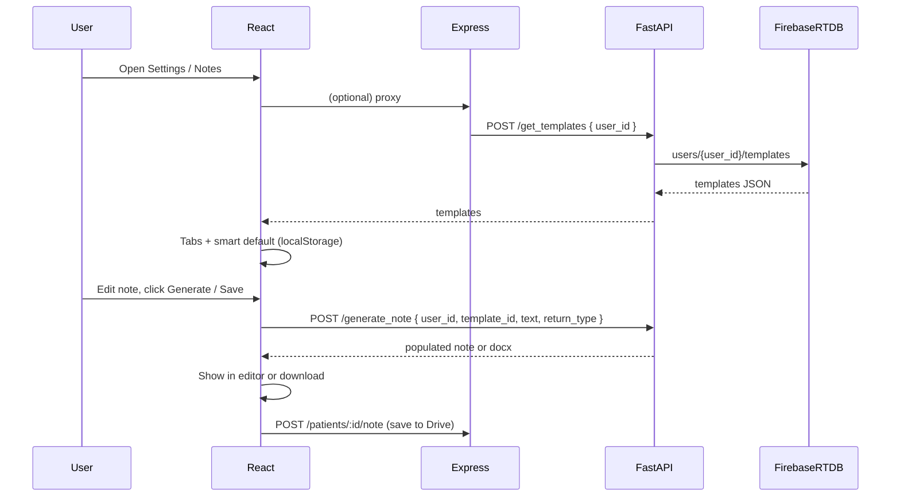

# Template Retrieval and Clinical Note Generation

## Current state

- **Frontend**: React app with Settings modal containing a "Documentation Template" section (SOAP vs Custom pills, custom upload). Notes are edited in [NoteEditor](client/src/components/NoteEditor.tsx) and saved via [POST /api/drive/patients/:id/note](server/routes/drive.ts) (content only; no template_id or population).
- **Backend**: Express only; no FastAPI, no Firebase RTDB in this repo. You confirmed FastAPI + Firebase run **externally**; this plan only adds frontend calls and an optional Express proxy.

## Architecture (target)

## Feature 1: Template retrieval and smart UI

### 1.1 Backend contract (external FastAPI)

- **POST /get_templates**  
Body: `{ "user_id": "string" }`.  
Backend must query Firebase RTDB at `users/{user_id}/templates` and return that JSON as the response body (no extra wrapping required; if the spec says "exact JSON object", the response can be the template object or `{ templates: [...] }` depending on RTDB shape — frontend will accept either and normalize to a list of `{ id, name, ... }` for display).

### 1.2 Frontend: config and user identity

- **FastAPI base URL**  
Add `VITE_NOTES_API_URL` (or similar) in client `.env`. If empty, the new template/note features are hidden or no-op.
- **user_id**  
The React app currently has only `userEmail` from [checkAuth](client/src/services/api.ts) (Express session). For FastAPI, the frontend must send a stable `user_id`. Options (pick one and document):
  - **A)** Add an Express endpoint (e.g. `GET /api/auth/me`) that returns `{ email, user_id }` where `user_id` is defined by your auth (e.g. Firebase UID or email-based id), and have the FastAPI backend accept that same id for RTDB.
  - **B)** Add Firebase Auth in the client and use `auth.currentUser.uid` as `user_id` for all note API calls.
  Plan assumes one of these is in place so the client can call `getTemplates(user_id)` and `generateNote(user_id, ...)`.

### 1.3 Frontend: API client

- **File**: [client/src/services/api.ts](client/src/services/api.ts) (or a dedicated `client/src/services/notesApi.ts`).
- Add:
  - `getTemplates(userId: string): Promise<TemplateListResponse>`  
    - `POST ${NOTES_API_URL}/get_templates` with `{ user_id: userId }`, return the JSON (normalize to a list of items with at least `id` and a display `name`/`label`; if the API returns a single object with template keys, convert to array).
  - `generateNote(params: { user_id: string; template_id: string; text: string; return_type: 'note' | 'docx' }): Promise<{ content?: string; blob?: Blob } | string>`  
    - `POST ${NOTES_API_URL}/generate_note` with that body. For `return_type: 'note'` assume JSON `{ content: string }` or plain text; for `return_type: 'docx'` assume binary response; return something the UI can use (e.g. content string or blob for download).
- Types: define `TemplateListResponse` and template item shape (e.g. `{ id: string; name?: string; type?: string }`) in [shared/types.ts](shared/types.ts) or next to the client API.

### 1.4 Frontend: Templates section (tabbed UI + smart default)

- **Placement**: Reuse and extend the existing "Documentation Template" block in [SettingsModal](client/src/components/SettingsModal.tsx) (around lines 306–390). Add a **source**: "From practice" (or "From server") that uses the FastAPI template list when `VITE_NOTES_API_URL` is set; keep existing SOAP / Custom as fallback when API is not configured or returns nothing.
- **Behavior**:
  - When the Settings modal opens (and Notes API URL is set), call `getTemplates(user_id)` once.
  - **Tabbed / pill UI**: Render templates as pill or tab buttons (not a `<select>`). If the API returns a `type` or category (e.g. "Clinical Notes", "Referrals"), group by that and show tabs per group, then pills per template inside, or a single row of pills with optional grouping. If no grouping, a single row of pills is enough.
  - **Smart default**:
    - If the API returns **one** template: set it as the active `template_id` in state and do not require a click.
    - If **multiple**: read `localStorage.getItem('halo_lastTemplateId')`; if it matches one of the returned template ids, use it as active; otherwise default to the first template in the array.
  - On template change: `localStorage.setItem('halo_lastTemplateId', template_id)` and update state so the chosen `template_id` is used for the next `generate_note` call.
- **State**: Store the selected `template_id` in React state in the modal. If you want the same selection to be used when writing notes outside Settings, lift state to App or a small context, or persist "last used template" only in localStorage and have the note screen read it when calling `generate_note`.

### 1.5 Optional: Express proxy

- To avoid CORS and keep credentials on one origin, add optional proxy routes in [server/index.ts](server/index.ts) or a new `server/routes/notesProxy.ts`:
  - `POST /api/notes/get_templates`: body `{ user_id }`; forward to `POST ${NOTES_API_URL}/get_templates` (with `user_id` from session if you prefer to not send it from the client).
  - `POST /api/notes/generate_note`: forward body to FastAPI `POST /generate_note`, then stream back the response (JSON or binary).
- If you use the proxy, the client uses `request('/api/notes/get_templates', ...)` and `request('/api/notes/generate_note', ...)` with the existing `credentials: 'include'`; no separate FastAPI origin in the browser.

---

## Feature 2: Clinical note generation (strict legacy compliance)

### 2.1 Frontend: Submit flow

- **Where**: The note is edited in [PatientWorkspace](client/src/pages/PatientWorkspace.tsx) / [NoteEditor](client/src/components/NoteEditor.tsx). Add a **"Generate from template"** (or similar) action that:
  1. Takes current `noteContent` (and selected `template_id` from Settings/localStorage).
  2. Calls `generateNote({ user_id, template_id, text: noteContent, return_type: 'note' })`.
  3. On success: sets the returned content into `noteContent` (or opens a preview) so the user can edit and then click **Save Note** (existing flow: POST to Express to save to Drive).
- **return_type**:
  - **"note"**: display in editor (and optionally allow "Save Note" to persist to Drive via existing endpoint).
  - **"docx"**: if the backend returns a file, trigger a download or offer "Save to Drive" using existing upload/save flow if you add it.
- **user_id**: Use the same value used for `get_templates` (from session/me or Firebase Auth).
- **Error handling**: Show a toast or inline error if the FastAPI call fails; do not overwrite the editor with partial content.

### 2.2 Backend: FastAPI `/generate_note` (external; to implement in your repo)

- **Contract**: Accept `POST /generate_note` with body:
  - `user_id: string`
  - `template_id: string`
  - `text: string`
  - `return_type: "note" | "docx"`
- **Strict legacy behavior**: You will add **admin account.pdf** and **tom debbie.pdf** to this workspace before implementation. Then:
  1. **Extract** from the PDFs: the JavaScript/Apps Script logic, placeholder rules (e.g. `{{field}}` or similar), section mapping, and any formatting rules (dates, line breaks, headings).
  2. **Translate** that logic into Python in `app.py` in the `@app.post("/generate_note")` handler:
    - Load the template for `user_id` + `template_id` (from RTDB or from the same structure as `/get_templates`).
    - Apply the **exact** same population rules (replace placeholders from `text`, respect sections and formatting).
    - If `return_type == "note"`: return JSON `{ "content": "<populated note text>" }` or plain text.
    - If `return_type == "docx"`: generate a DOCX using the populated content (e.g. `python-docx`) and return it as a binary response with appropriate `Content-Disposition` / `Content-Type`.
- No new formatting rules should be invented; the Python code must mirror the legacy behavior described in the PDFs.

---

## Execution summary (file-level)

| Context            | File(s)                                                         | Action                                                                                                                                                                                                     |
| ------------------ | --------------------------------------------------------------- | ---------------------------------------------------------------------------------------------------------------------------------------------------------------------------------------------------------- |
| Frontend           | `client/src/services/api.ts` or `notesApi.ts`                   | Add `getTemplates(user_id)`, `generateNote({ user_id, template_id, text, return_type })` with `VITE_NOTES_API_URL`.                                                                                        |
| Frontend           | `shared/types.ts`                                               | Add types for template list and generate-note payload/response.                                                                                                                                            |
| Frontend           | `client/src/components/SettingsModal.tsx`                       | Integrate fetch to `/get_templates`, tabbed/pill template list, smart default (1 = auto; many = localStorage then first), persist `halo_lastTemplateId`.                                                   |
| Frontend           | `client/src/pages/PatientWorkspace.tsx` and/or `NoteEditor.tsx` | Add "Generate from template" button; call `generateNote` with current text and selected `template_id`; write result into note content; keep existing Save to Drive.                                        |
| Frontend           | `.env` / `.env.example`                                         | Document `VITE_NOTES_API_URL` (optional).                                                                                                                                                                  |
| Backend (optional) | `server/routes/notesProxy.ts` or `server/index.ts`              | Optional proxy `POST /api/notes/get_templates` and `POST /api/notes/generate_note` to FastAPI.                                                                                                             |
| Backend (external) | Your FastAPI `app.py`                                           | Implement `POST /get_templates` (RTDB `users/{user_id}/templates`) and `POST /generate_note` by translating legacy logic from **admin account.pdf** and **tom debbie.pdf** once they are in the workspace. |

---

## Dependency: PDFs and user_id

- **PDFs**: Implementation of the exact `/generate_note` population rules in Python will be done **after** you add **admin account.pdf** and **tom debbie.pdf** to the workspace (or provide their path). The frontend and API contract can be implemented immediately; the backend logic will follow a second pass that reads those PDFs and translates the described behavior into Python.
- **user_id**: Ensure one of the options (Express `/me` returning `user_id`, or Firebase Auth in the client) is decided and implemented so the frontend can pass a consistent `user_id` to both `/get_templates` and `/generate_note`.

