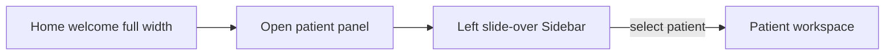
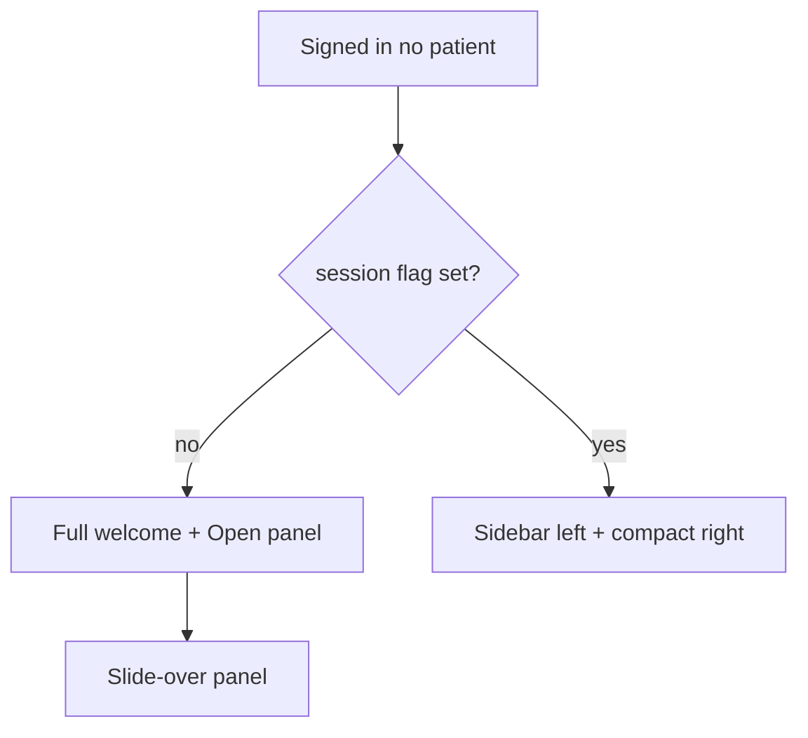

# Welcome-first entrance + patient panel button

## Problem

- Today, when **no patient** is selected, the **inline [`Sidebar`](../../client/src/components/Sidebar.tsx)** is always in the layout ([`App.tsx`](../../client/src/App.tsx) ~315–333), and the welcome sits beside it.
- The **mobile drawer** that reuses `Sidebar` is gated by `selectedPatientId && patientsDrawerOpen` and uses **`lg:hidden`** on the drawer container (~345), so it **never opens on large screens** in any flow.
- Result: on desktop “home,” users still fight a split layout, and the welcome can feel missing or cramped on the right.

## Target UX

1. **First entrance = welcome only** — one column, full width, `min-h-dvh`, hero content (logo + personalized / profile CTA + Open patient panel). **Subsequent “Back” to home** = list on the left + compact right (see below).
2. **Explicit “Open patient panel”** — primary (or strong secondary) button that sets `patientsDrawerOpen` to `true`.
3. **Panel = same `Sidebar`**, in a **left overlay** with backdrop, **including on `lg+` when there is no selected patient** (so desktop matches the mental model).
4. **After a patient is selected** — behavior stays as today: `selectedPatientId` set, drawer closes (`selectPatientFromDrawer` already does this), user sees [`PatientWorkspace`](../../client/src/pages/PatientWorkspace.tsx); **inline sidebar returns from `lg`** via existing `hidden lg:flex` wrapper on the sidebar column.

## Return home vs first landing (after login)

Goal: **only the first time** (in a session) that the user lands with no patient selected do they see the **full hero welcome** and must use **Open patient panel** (or profile CTA). **Every later time** they arrive with no patient—typically **Back** from [`PatientWorkspace`](../../client/src/pages/PatientWorkspace.tsx)—they should see the **patient list on the left**, **not** the full welcome again.

**Suggested behavior**

- Persist a **session flag** in `sessionStorage`, e.g. `halo_hasOpenedPatient`, set to `1` the first time the user **selects a patient** (in `selectPatient` when `id` is non-null). **Clear the flag on logout** so the next login gets the hero again.
- **`!selectedPatientId` && flag not set (first home):** **no inline sidebar**, full-width welcome, **Open patient panel** opens the slide-over (including on `lg+`).
- **`!selectedPatientId` && flag set (return home):**
  - **`lg+`:** **inline [`Sidebar`](../../client/src/components/Sidebar.tsx)** visible (split layout); **right pane = compact** — short line such as “Choose a patient to open their workspace” (optional small logo or none), **no** large duplicate hero.
  - **`<lg`:** Prefer **auto-opening the patient drawer once** when navigating back to home (`useEffect` when `selectedPatientId` becomes null and flag set) so the list is on the left without an extra tap; user dismisses with backdrop as today. (If auto-open feels noisy, fallback: compact strip + same Open patient panel button.)

## Implementation (single file + small hook)

**File: [`client/src/App.tsx`](../../client/src/App.tsx)**

1. **Session flag** — helper `readHasOpenedPatient()` / `setHasOpenedPatient()` using `sessionStorage`; clear in **logout** handler. Set when user **chooses a patient** (non-null `selectPatient`).
2. **Import** [`useMediaQuery`](../../client/src/hooks/useMediaQuery.ts): e.g. `const isLg = useMediaQuery('(min-width: 1024px)')`.
3. **When `!selectedPatientId`:**
   - **First landing (`!hasOpenedPatient`):** **no** inline sidebar; full-width **hero** welcome; shell `flex-col` + `min-h-dvh`.
   - **Return home (`hasOpenedPatient`):** **`flex-row`** with **inline sidebar** (`flex` + `shrink-0`) on **`lg+`** same as when a patient is selected; main = **compact** empty state only.
   - When **`selectedPatientId`:** keep existing row + sidebar visibility rules (unchanged).
4. **Optional `useEffect`:** when `selectedPatientId` goes from truthy to `null` and `hasOpenedPatient && !isLg`, set `patientsDrawerOpen(true)` once (guard with ref if needed to avoid fighting manual close).
5. **Unify drawer visibility** — replace `selectedPatientId && patientsDrawerOpen` with logic:
   - `showPatientDrawer = patientsDrawerOpen && (!selectedPatientId || !isLg)`
   - **Home:** `!selectedPatientId` → drawer may show on **all** breakpoints when open.
   - **In workspace:** drawer only when **not** `lg` (inline sidebar covers `lg+`), preserving current behavior.
6. **Drawer markup classes**
   - **Backdrop:** visible whenever `showPatientDrawer`; drop `lg:hidden` when `!selectedPatientId` (or drive from `showPatientDrawer` only).
   - **Panel:** replace hard-coded `lg:hidden` on the fixed container with: show when `showPatientDrawer`; use `w-80 max-w-[85vw]` as today. Optional: `shadow-2xl border-r` for desktop polish.
7. **Welcome / compact copy** (~396+ area)
   - **Hero path (first landing only):** “Open patient panel” button, shortened body copy, practitioner profile CTA when needed, optional icon (`Users` / `PanelLeft`).
   - **Compact path (return home):** no big logo; one short instruction line only; optional secondary “Open panel” if drawer is not auto-shown.
8. **Close drawer**
   - Backdrop and selecting a patient already close via `selectPatientFromDrawer`.
   - Consider adding a **close control** on the drawer edge or relying on Sidebar if it has no explicit close—if needed, a slim top bar with “Close” for the overlay mode only (minimal change: backdrop click already present).
9. **Regression checks**
   - With patient open on `lg+`, inline sidebar still visible; `patientsDrawerOpen` from PatientWorkspace on small screens still shows drawer (`showPatientDrawer === true`).
   - Sign-out, create patient, settings links inside `Sidebar` still work inside the overlay.

## Files touched

- [`client/src/App.tsx`](../../client/src/App.tsx) only (layout, drawer condition, welcome button/copy).

## Out of scope

- Redesigning `Sidebar` internals.
- Renaming `patientsDrawerOpen` (optional cleanup later).
